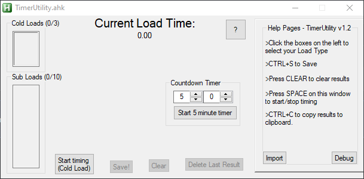
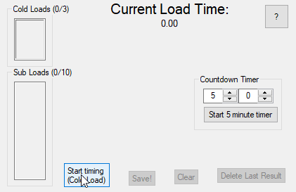
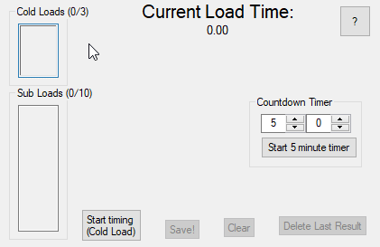
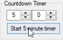

# TimerUtility // Load Timer

**// About this project//**

A simple AutoHotkey application for assisting a tester in timing the length of time an application takes to load.

It provides users with space for 3x 'Cold' loads (loading after re-booting the host machine) and 10x 'Subsequent' (re-loading the software after it has already been loaded) loads.

I created this for myself and co-workers to avoid having to time these results manually AND have to write them down each time. With this app, everything can be done in one place.

# Auto-progress
When the 1st 3 'Cold Loads' are complete, the next results are automatically placed into the next 'Sub Loads' section for ease of use. 

# Choosing the load-type
If the user wishes to record their results in a different order to 3xcold then 10xsub loads, the user may simply click on either results box and the results will be added into that section instead.

# Countdown Timer with notification
If the testing requires you to wait for any length of time prior to taking a result, this handy in-app timer can be set up easily. It currently defaults to 5 minutes, and will countdown to 0

Once the timer is complete, a standard Windows notification sound will be played and a 'Toast' (win10+)notification displayed

The values entered into this timer are also auto-saved for the next session, and there is a 'Reset' button that can be used to set it back to the default 5 minutes.

# Autosave
Each time a result is recorded, the entire array of results is written out to an autosave file in %appdata%\DewrDev\TimerUtility

If the application is exited without saving or manually clearing the data, the autosave data is automatically loaded back into the program and users can resume from where they left-off without losing the results

Autosave **is** updated upon using the 'Delete Last Result' function, but that function also features a 'Confirm' dialogue.

# Delete Last Result
Useful for removing results that are recorded in incorrectly or accidentally. Upon pressing this button, the user is presented with a 'Confirm/Cancel' dialogue box just in-case the button was pressed in error

# Restore Last Result

In-case the last result was deleted in error (using the 'Delete Last Result' button as mentioned above), that result can actually be restored within the current session. Note that deleted results are not permanently stored, and will be lost if the app is restarted or if a new Result is taken.

# Export to file
Using the 'Save' button or the hotkey CTRL+S, the current results can be easily exported to a .txt file. I found this useful for saving my results for later use if needed.

# Import
Assuming results follow the export format, previous results can also be re-imported back into the application with ease. This function primarily exists for the 'Autosave' function to auto-import previous results, but *can* be triggered manually via the 'Import' button.

# HOTKEY: Spacebar to Start/Stop
The **[SPACEBAR]** can be used to start/stop timing while the application is focused. This is more reliable than using the on-screeen button as the mouse cursor could slip while the user is not looking.

# Future plans
For upcoming versions, I would ideally like to make the application customisable in terms of the amount of results that can be recorded. I could most likely keep the boxes at their current *size*, but have them become 'scrollable' 

A rather simple addition would be to have it *remember* the last known 'Custom Timer' time as opposed to it always defaulting to 5 minutes. For this countdown timer, I would also like to make the notification sound loop (as opposeed to only playing once) and give users the option to make the visual notification more... apparent.

###### I initially wrote this without GIT, so the 'initial commit' is just the final result. Whoops, I learned that lesson.